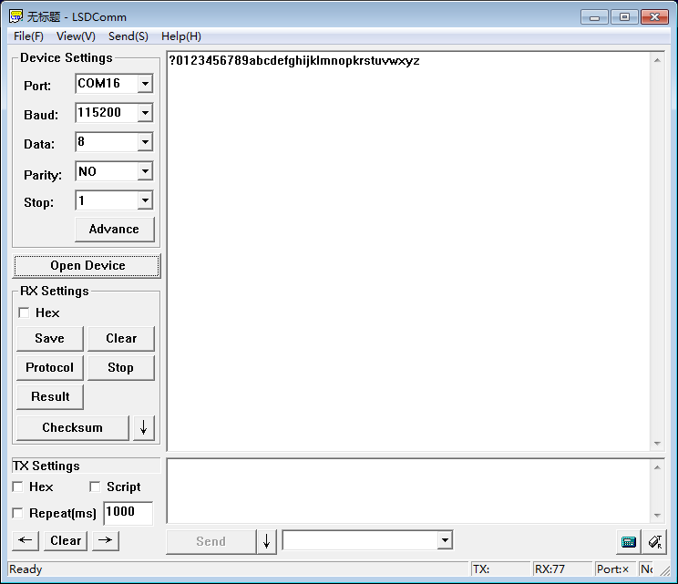
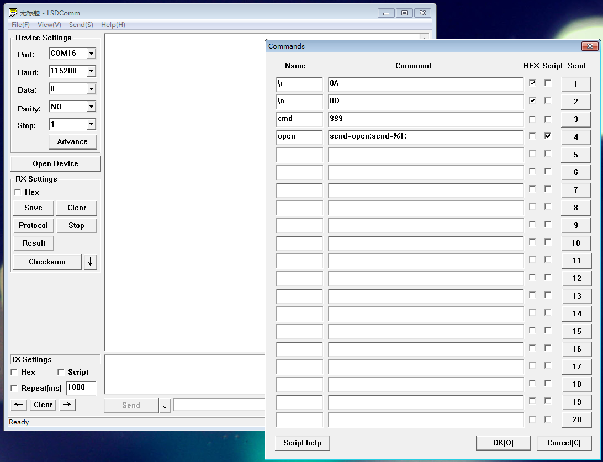

 
## lsdcomm
A serial communication tool for windows. A chinese version is on [git.oschina.net](http://git.oschina.net/yihui/lsdcomm/).

## Feature
+ Support HEX, simple script
+ Support history
+ Easy to upgrade

## Dowloand
[lsdcomm-latest.exe](https://github.com/xiongyihui/lsdcomm/raw/master/release/LSDComm-latest.exe)

## Screenshot

